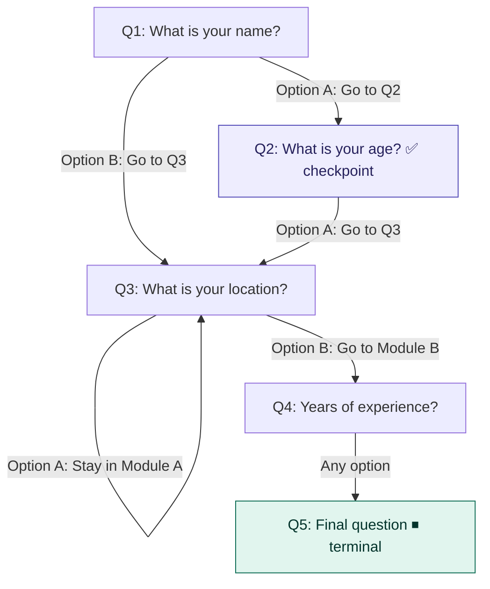

# Conversation Flow System

A scalable backend system for a **modular, state-driven conversation engine**, where questions form a graph and user progression is deterministic and auditable.

Built as part of a Backend Engineer (Junior) take-home assignment.

---

## 🚀 Key Highlights

* Graph-based conversation engine (state machine model)
* Strict separation of **state vs history (immutable logging)**
* Checkpoint-aware navigation with controlled rollback
* Defensive handling of invalid flows and broken references
* Extensible across modules and conversation flows

---

## 🛠 Tech Stack

* Node.js, Express
* MongoDB, Mongoose
* Joi (validation)

---

## ⚙️ Setup

```bash
git clone <your-repo-url>
cd conversation-flow
npm install
```

Create `.env`:

```
MONGO_URI=your_mongodb_connection_string
PORT=3000
NODE_ENV=development
```

Run:

```bash
npm run seed
npm run dev
```

---

## 📡 API

| Method | Endpoint                               | Description                |
| ------ | -------------------------------------- | -------------------------- |
| POST   | `/modules/:moduleId/start`             | Start module               |
| POST   | `/answer`                              | Submit answer              |
| GET    | `/users/:userId/current`               | Current question           |
| GET    | `/users/:userId/history`               | Full history               |
| GET    | `/users/questions/:questionId?userId=` | Deep link                  |
| POST   | `/go-back`                             | Go back (checkpoint-aware) |

---

## 🧠 Architecture

### State vs History

* `User` → current position
* `History` → append-only log

Ensures scalability and auditability.

---

## 🗺 Conversation Flow Diagram



> **Checkpoint (purple):** go-back cannot move past this point.  
> **Terminal (green):** flow ends here, no next question.
>
> 
### Graph-Based Flow

* Questions = nodes
* Options = edges
* Supports cross-module navigation and terminal states

---

### Checkpoints

* Stored as `checkpointQuestionIds[]`
* Prevents invalid rollback
* History remains unchanged

---

### Deep Link Handling

* Invalid/stale → fallback to current
* Always returns safe state (`redirected: true`)

---

### Defensive Handling

* Invalid input → 400
* Missing data → 400
* Not found → 404
* Broken references → fallback

---

## 🧪 Testing

* Postman tested
* Edge cases validated
* Automated test coverage included

---

## 📁 Structure

```
src/
├── controllers/
├── services/
├── models/
├── routes/
├── config/
└── tests/
```

---

## 💡 Principles

* Backend is source of truth
* History is immutable
* State transitions are deterministic
* System is extensible

---

## 📌 Note

Focus is on **correctness, reliability, and clean architecture** rather than quick implementation.
